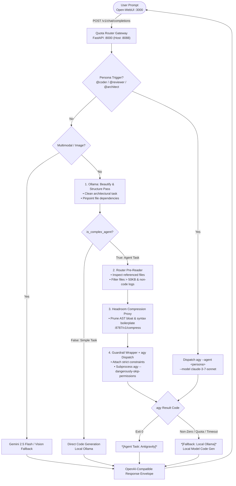

# AI Compression Stack

A containerized context-routing, multi-agent dispatch, and compression stack designed to preserve upstream LLM token quotas, eliminate vendor lock-in, and provide automated agent personas.

Incoming requests to the OpenAI-compatible gateway are analyzed, distilled via local models (Ollama), stripped of AST/JSON bloat using Headroom, and executed via Antigravity (`agy` CLI) or local Ollama with zero required cloud API keys.

---

## Architecture & Workflow

```
User Prompt (Open WebUI / API)
           │
           ├── [Persona Mention / Trigger?]
           │     ├── @coder / /coder         ──► Dispatches agy --agent coder
           │     ├── @reviewer / /reviewer   ──► Dispatches agy --agent reviewer
           │     └── @architect / /architect ──► Dispatches agy --agent architect
           │
           ▼
[ Ollama: Beautify & Structure Pass ]
   - Converts prompt to structured engineering specification
   - Isolate file dependencies and evaluates complexity
           │
           ├── Simple Task ──► Direct Local Ollama Generation (or Gemini Flash)
           │
           ▼ (Complex Task)
[ Router Pre-Reader & Filter ]
   - Ingests referenced files from /workspace (rejects >50KB & non-code logs)
           │
           ▼
[ Headroom Compression Proxy ]
   - Prunes AST boilerplate, syntax repetition, and JSON bloat (:8787)
           │
           ▼
[ Guardrail Wrapper + agy Dispatch ]
   - Subprocess agy --model <AGY_MODEL> --add-dir /workspace --dangerously-skip-permissions
   - Outgoing provider traffic routed through Headroom proxy
           │
           ▼
[ Execution or Local Fallback ]
   - Exit 0: Emits clean OpenAI response envelope
   - Non-zero / Timeout / 429 Quota: Automatic fallback to local Ollama
```

### Flowchart



---

## Services Overview

The stack is composed of 4 containerized services managed via `docker-compose.yml`:

| Service | Container Name | Host Port | Internal Port | Description |
| :--- | :--- | :--- | :--- | :--- |
| **`router`** | `quota-router` | `8088` | `8000` | FastAPI gateway providing OpenAI-compatible `/v1/chat/completions`, model registry, persona dispatch, and cold-start fallback. |
| **`headroom`** | `headroom-proxy` | `8787` | `8787` | Context compression proxy utilizing `headroom-ai` to strip JSON/AST and multi-turn bloat before execution. |
| **`ollama`** | `local-ollama` | `11434` | `11434` | Local model inference engine (`qwen2.5-coder:1.5b`) for prompt distillation, classification, and offline fallback. |
| **`open-webui`** | `open-webui` | `3000` | `8080` | Full-featured chat interface wired to `http://router:8000/v1` with native model/persona autocompletion. |

---

## Multi-Agent Personas

The stack natively supports specialized personas declared in `.antigravity/agents/`:

| Persona | Triggers | Description |
| :--- | :--- | :--- |
| **`coder`** | `@coder`, `/coder`, `@dev`, `@implement` | Senior Software Engineer & Implementation Specialist: minimal-diff coding, bug fixes, test-driven validation strictly within `/workspace`. |
| **`reviewer`** | `@reviewer`, `/reviewer`, `@audit` | Senior Security and Quality Auditor: inspects code for vulnerabilities, edge-case bugs, missing error branches, and suggests minimal patches. |
| **`architect`** | `@architect`, `/architect` | System Architect: pre-implementation blueprints, interface contracts, and phased technical implementation roadmaps. |

### Global Directives (`AGENTS.md`)
The project root includes [AGENTS.md](AGENTS.md) enforcing:
- Operational scope restricted exclusively to `/workspace`.
- Mandatory pre-reading before modifying code.
- Non-destructive, minimal-diff editing practices.

---

## Key Features

- **Multi-Agent Persona Dispatching**: Select personas from Open WebUI's model dropdown or trigger them inline via `@coder`, `@reviewer`, or `@architect`.
- **100% Abstract & Portable**: Uses dynamic `${HOST_HOME}` volume expansion on the host and standardized `/home/appuser` inside the container. Works seamlessly across Linux, macOS, and Windows WSL with zero hardcoded usernames.
- **Headless MCP Execution**: Bundles a lightweight zero-dependency MCP server (`mcp_workspace.py`) that equips `agy` in headless container mode with full `write_to_file` and non-interactive `run_command` execution capabilities.
- **Headroom Compression Proxy**: Routes outgoing provider traffic (`ANTHROPIC_BASE_URL`, `OPENAI_BASE_URL`) through Headroom to compress prompts and prune repetitive AST bloat.
- **Quota & Timeout Protection**: Automatically catches CLI 429 quota limits, rate limits, or cold-start timeouts and fails over to local Ollama in real time without failing user requests.
- **Live Logging Visibility**: Real-time unbuffered log emission `[ROUTER] Target: ...` in Docker logs for full observability of dispatch decisions.

---

## Getting Started

### Prerequisites
- [Docker](https://docs.docker.com/get-docker/) & Docker Compose v2+
- Linux, macOS, or Windows WSL2
- [Antigravity CLI](https://github.com/google/antigravity) (`agy`) installed and logged in on the host (defaults to `~/.local/bin/agy`)
- Ollama model (defaults to `qwen2.5-coder:1.5b`)

### Quickstart

1. **Clone the repository:**
   ```bash
   git clone https://github.com/<your-username>/ai-compression-stack.git
   cd ai-compression-stack
   ```

2. **Configure environment variables:**
   ```bash
   cp .env.example .env
   ```
   *(All defaults work out of the box with zero required API keys).*

3. **Build and launch the stack:**
   ```bash
   docker compose up -d --build
   ```

4. **Verify health connectivity:**
   ```bash
   curl -i http://localhost:8088/healthz
   ```

5. **Access the Open-WebUI Frontend:**
   Open your browser to [http://localhost:3000](http://localhost:3000).

---

## Configuration Reference

Customize these variables in your `.env` file:

| Variable | Default | Description |
| :--- | :--- | :--- |
| `AGY_MODEL` | `claude-3-7-sonnet` | Model target used by Antigravity CLI (`agy --model`). |
| `OLLAMA_MODEL` | `qwen2.5-coder:1.5b` | Model used for local distillation, simple tasks, and offline fallback. |
| `PORT_ROUTER` | `8088` | Host port exposed for the Quota Router Gateway. |
| `HOST_UID` | `1000` | Host user ID mapped into the container. |
| `HOST_GID` | `1000` | Host group ID mapped into the container. |
| `WORKSPACE_PATH` | `~/development` | Host path bind-mounted to `/workspace` inside containers. |
| `AGY_BIN_PATH` | `~/.local/bin/agy` | Host path to the `agy` CLI binary. |
| `HOST_LOCAL_PATH` | `~/.local` | Host path to `.local` directory (keyrings / auth). |
| `HOST_CONFIG_PATH` | `~/.config` | Host path to `.config` directory (CLI configurations). |
| `HOST_GEMINI_PATH` | `~/.gemini` | Host path to `.gemini` directory (installation ID & session tokens). |
| `HEADROOM_PROXY` | `http://headroom:8787` | Internal Docker URL for the Headroom proxy service. |
| `OLLAMA_URL` | `http://ollama:11434` | Internal Docker URL for the Ollama service. |
| `GEMINI_API_KEY` | *(empty)* | Optional Gemini API key. If omitted, routes via Ollama / `agy`. |

---

## Usage & API Testing

### 1. Persona Prompts in Open WebUI
In [http://localhost:3000](http://localhost:3000), select `auto-router` (or any persona model) and type:
- `@coder Implement a retry loop with exponential backoff for the HTTP client`
- `@reviewer Check router/app.py for unhandled exceptions and security risks`
- `@architect Design a modular plugin architecture for the compression router`

### 2. OpenAI-Compatible API Call
```bash
curl -s -X POST http://localhost:8088/v1/chat/completions \
  -H "Content-Type: application/json" \
  -d '{
    "model": "coder",
    "messages": [
      {"role": "user", "content": "Write unit tests for the token counter"}
    ]
  }'
```

### 3. Health Check
```bash
curl -s http://localhost:8088/healthz
```

---

## License
MIT