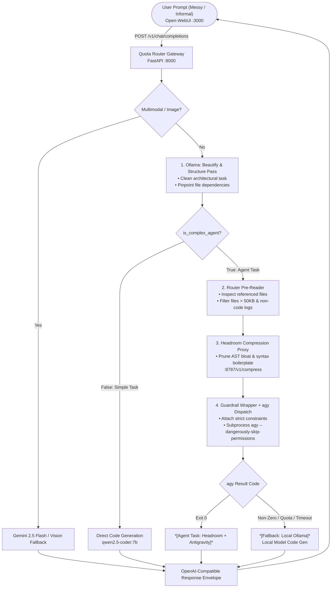

# AI Compression Stack

A fully open-source, containerized context-routing and compression stack designed to preserve upstream LLM token quotas, eliminate vendor lock-in, and provide automated agent dispatch.

Incoming requests to the OpenAI-compatible gateway are analyzed, distilled via local models (Ollama), stripped of AST/JSON bloat using Headroom, and executed via Antigravity (`agy` CLI) or local Ollama with zero required cloud API keys.

---

## Architecture & Workflow

```
User Prompt (Messy / Informal)
           │
           ▼
[ Ollama: Beautify & Structure Pass ]
  - Converts prompt to clean architectural task
  - Pinpoints specific files & dependencies
           │
           ▼
[ Router Pre-Reader & Filter ]
  - Gathers referenced files from codebase
  - Rejects oversized files (>50KB) or non-code logs
           │
           ▼
[ Headroom Compression Proxy ]
  - Prunes AST boilerplate & repetitive syntax bloat
           │
           ▼
[ Guardrail Wrapper + agy Dispatch ]
  - Appends strict execution constraints
  - Dispatches non-interactively via `agy -p ...`
           │
           ▼
[ Execution or Local Fallback ]
  - Emits clean OpenAI response envelope
  - Automatic fallback to local Ollama on failure/timeout
```

### Detailed Flowchart



---

## Services Overview

The stack is composed of 4 containerized services managed via `docker-compose.yml`:

| Service | Container Name | Port | Description |
| :--- | :--- | :--- | :--- |
| **`router`** | `quota-router` | `8000` | FastAPI gateway providing an OpenAI-compatible `/v1/chat/completions` API and health probes. Manages distillation, compression calls, and non-interactive `agy` dispatch. |
| **`headroom`** | `headroom-proxy` | `8787` | Context compression proxy utilizing `headroom-ai` to strip JSON/AST and multi-turn bloat before execution. |
| **`ollama`** | `local-ollama` | `11434` | Local model inference engine serving `qwen2.5-coder:7b` for prompt distillation, classification, and offline fallback code generation. |
| **`open-webui`** | `open-webui` | `3000` | Full-featured chat interface wired to `http://router:8000/v1` as an OpenAI backend. |

---

## Key Features

- **100% Keyless Agent Dispatch**: Mounts host authentication credentials (`~/.config`, `~/.local`) and the `agy` binary directly into the router container, utilizing existing developer CLI sessions without needing API keys.
- **Dynamic & Portable Mounts**: Uses Docker Compose tilde (`~`) and environment variable expansion (`${AGY_BIN_PATH:-~/.local/bin/agy}`) so no personal usernames or system-specific paths are tracked in Git.
- **Intelligent Context Distillation**: Prompts are passed through Ollama with a strict JSON schema to isolate dependencies and classify whether a request requires tool execution or standard completion.
- **Headroom Compression Layer**: Eliminates token bloat prior to running multi-file coding agent tasks, keeping token consumption within rate limits.
- **Automated Fallback Pipeline**: If `agy` encounters a non-zero exit code, times out (180s limit), or hits rate limits, the request automatically falls back to local Ollama code generation without failing the user's request.

---

## Getting Started

### Prerequisites
- [Docker](https://docs.docker.com/get-docker/) & Docker Compose v2+
- Linux or WSL2 (Windows Subsystem for Linux)
- [Antigravity CLI](https://github.com/google/antigravity) (`agy`) installed and logged in on the host (defaults to `~/.local/bin/agy`)
- Ollama model `qwen2.5-coder:7b` (pulled automatically or via `docker exec -it local-ollama ollama pull qwen2.5-coder:7b`)

### Quickstart

1. **Clone the repository:**
   ```bash
   git clone https://github.com/<your-username>/ai-compression-stack.git
   cd ai-compression-stack
   ```

2. **Configure environment variables (optional):**
   ```bash
   cp .env.example .env
   ```
   *(All defaults work out of the box with zero API keys required).*

3. **Build and launch the stack:**
   ```bash
   docker compose up -d --build
   ```

4. **Verify health connectivity:**
   ```bash
   curl -i http://localhost:8000/healthz
   ```

5. **Access the Open-WebUI Frontend:**
   Open your browser to [http://localhost:3000](http://localhost:3000).

---

## Configuration Reference

Set these variables in your `.env` file to customize host paths or models:

| Variable | Default | Description |
| :--- | :--- | :--- |
| `OLLAMA_MODEL` | `qwen2.5-coder:7b` | Model used for local distillation, simple tasks, and fallbacks. |
| `GEMINI_API_KEY` | *(empty)* | Optional Gemini API key. If empty, all tasks default to Ollama / local `agy` session. |
| `AGY_BIN_PATH` | `~/.local/bin/agy` | Custom host path to the `agy` CLI binary. |
| `HOST_LOCAL_PATH` | `~/.local` | Custom host path to `.local` directory (keyrings / auth). |
| `HOST_CONFIG_PATH` | `~/.config` | Custom host path to `.config` directory (CLI configurations). |
| `HEADROOM_PROXY` | `http://headroom:8787` | Internal Docker URL for the Headroom proxy service. |
| `OLLAMA_URL` | `http://ollama:11434` | Internal Docker URL for the Ollama service. |

---

## API Testing

### 1. Simple Task (Local Ollama / Gemini)
```bash
curl -s -X POST http://localhost:8000/v1/chat/completions \
  -H "Content-Type: application/json" \
  -d '{
    "model": "auto-router",
    "messages": [
      {"role": "user", "content": "Write a Python quicksort function"}
    ]
  }'
```

### 2. Complex Agent Task (Distillation -> Headroom -> `agy` Dispatch)
```bash
curl -s -X POST http://localhost:8000/v1/chat/completions \
  -H "Content-Type: application/json" \
  -d '{
    "model": "auto-router",
    "messages": [
      {"role": "user", "content": "Refactor the database queries across all files"}
    ]
  }'
```

### 3. Health Check
```bash
curl -s http://localhost:8000/healthz
```
Expected response:
```json
{
  "status": "ok",
  "services": {
    "ollama": "reachable",
    "headroom": "reachable"
  },
  "ollama_url": "http://ollama:11434",
  "headroom_proxy": "http://headroom:8787"
}
```

---

## License
MIT